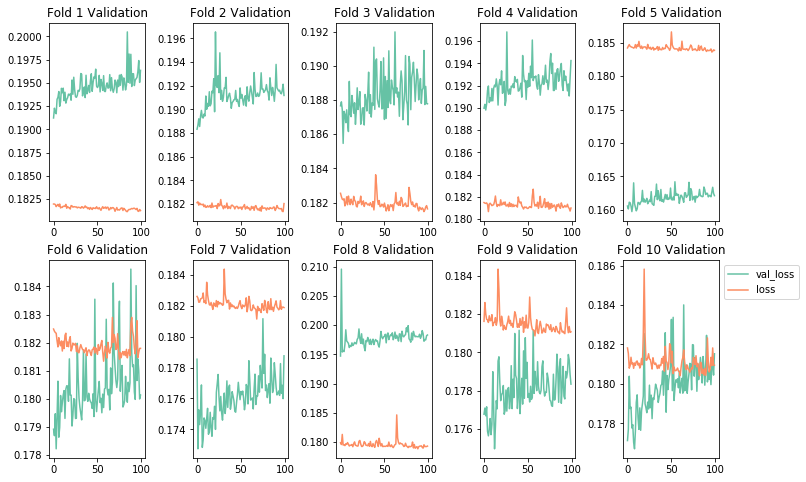
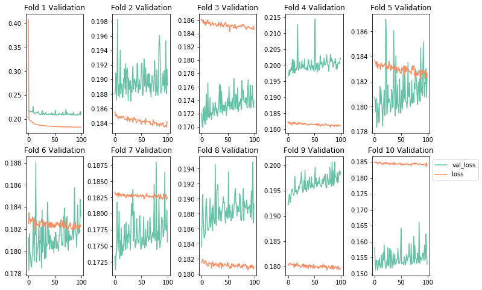
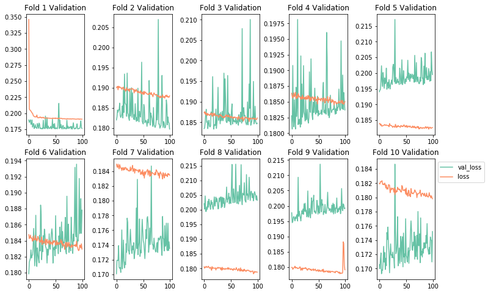
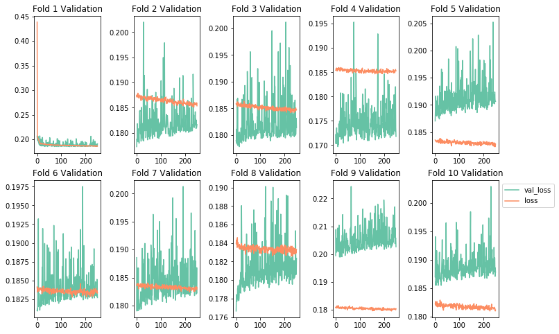

# Tuning and Optimizing Neural Networks - Lab

## Introduction

Now that we've discussed some regularization, initialization and optimization techniques, its time to synthesize those concepts into a cohesive modelling pipeline.  

With this pipeline, yoiu will not only fit an initial model but will also attempt to set various hyperparameters for regularization techniques. Your final model selection will pertain to the test metrics across these models. This will more naturally simulate a problem you might be faced with in practice, and the various modelling decisions you are apt to encounter along the way.  

Recall that our end objective is to achieve a balance between overfitting and underfitting. We've discussed the bias variance tradeoff, and the role of regularization in order to reduce overfitting on training data and improving generalization to new cases. Common frameworks for such a procedure include train/validate/test methodology when data is plentiful, and K-folds cross-validation for smaller, more limited datasets. In this lab, you'll perform the latter, as the dataset in question is fairly limited. 

## Objectives

You will be able to:

* Implement a K-folds cross validation modelling pipeline
* Apply normalization as a preprocessing technique
* Apply regularization techniques to improve your model's generalization
* Choose an appropriate optimization strategy 

## Loading the Data


```python
#Your code here; load and preview the dataset
import pandas as pd
data = pd.read_csv("loan_final.csv", header=0)
data = data.dropna()

print(np.shape(data))

data.head()

import time
import datetime

start = datetime.datetime.now()
```

    (41394, 16)


<div>
<style scoped>
    .dataframe tbody tr th:only-of-type {
        vertical-align: middle;
    }

    .dataframe tbody tr th {
        vertical-align: top;
    }

    .dataframe thead th {
        text-align: right;
    }
</style>
<table border="1" class="dataframe">
  <thead>
    <tr style="text-align: right;">
      <th></th>
      <th>loan_amnt</th>
      <th>funded_amnt_inv</th>
      <th>term</th>
      <th>int_rate</th>
      <th>installment</th>
      <th>grade</th>
      <th>emp_length</th>
      <th>home_ownership</th>
      <th>annual_inc</th>
      <th>verification_status</th>
      <th>loan_status</th>
      <th>purpose</th>
      <th>addr_state</th>
      <th>total_acc</th>
      <th>total_pymnt</th>
      <th>application_type</th>
    </tr>
  </thead>
  <tbody>
    <tr>
      <th>0</th>
      <td>5000.0</td>
      <td>4975.0</td>
      <td>36 months</td>
      <td>10.65%</td>
      <td>162.87</td>
      <td>B</td>
      <td>10+ years</td>
      <td>RENT</td>
      <td>24000.0</td>
      <td>Verified</td>
      <td>Fully Paid</td>
      <td>credit_card</td>
      <td>AZ</td>
      <td>9.0</td>
      <td>5863.155187</td>
      <td>Individual</td>
    </tr>
    <tr>
      <th>1</th>
      <td>2500.0</td>
      <td>2500.0</td>
      <td>60 months</td>
      <td>15.27%</td>
      <td>59.83</td>
      <td>C</td>
      <td>&lt; 1 year</td>
      <td>RENT</td>
      <td>30000.0</td>
      <td>Source Verified</td>
      <td>Charged Off</td>
      <td>car</td>
      <td>GA</td>
      <td>4.0</td>
      <td>1014.530000</td>
      <td>Individual</td>
    </tr>
    <tr>
      <th>2</th>
      <td>2400.0</td>
      <td>2400.0</td>
      <td>36 months</td>
      <td>15.96%</td>
      <td>84.33</td>
      <td>C</td>
      <td>10+ years</td>
      <td>RENT</td>
      <td>12252.0</td>
      <td>Not Verified</td>
      <td>Fully Paid</td>
      <td>small_business</td>
      <td>IL</td>
      <td>10.0</td>
      <td>3005.666844</td>
      <td>Individual</td>
    </tr>
    <tr>
      <th>3</th>
      <td>10000.0</td>
      <td>10000.0</td>
      <td>36 months</td>
      <td>13.49%</td>
      <td>339.31</td>
      <td>C</td>
      <td>10+ years</td>
      <td>RENT</td>
      <td>49200.0</td>
      <td>Source Verified</td>
      <td>Fully Paid</td>
      <td>other</td>
      <td>CA</td>
      <td>37.0</td>
      <td>12231.890000</td>
      <td>Individual</td>
    </tr>
    <tr>
      <th>4</th>
      <td>3000.0</td>
      <td>3000.0</td>
      <td>60 months</td>
      <td>12.69%</td>
      <td>67.79</td>
      <td>B</td>
      <td>1 year</td>
      <td>RENT</td>
      <td>80000.0</td>
      <td>Source Verified</td>
      <td>Fully Paid</td>
      <td>other</td>
      <td>OR</td>
      <td>38.0</td>
      <td>4066.908161</td>
      <td>Individual</td>
    </tr>
  </tbody>
</table>
</div>


```python
data.info()
```

    <class 'pandas.core.frame.DataFrame'>
    Int64Index: 41394 entries, 0 to 42516
    Data columns (total 16 columns):
    loan_amnt              41394 non-null float64
    funded_amnt_inv        41394 non-null float64
    term                   41394 non-null object
    int_rate               41394 non-null object
    installment            41394 non-null float64
    grade                  41394 non-null object
    emp_length             41394 non-null object
    home_ownership         41394 non-null object
    annual_inc             41394 non-null float64
    verification_status    41394 non-null object
    loan_status            41394 non-null object
    purpose                41394 non-null object
    addr_state             41394 non-null object
    total_acc              41394 non-null float64
    total_pymnt            41394 non-null float64
    application_type       41394 non-null object
    dtypes: float64(6), object(10)
    memory usage: 5.4+ MB


## Defining the Problem

Set up the problem by defining X and y. 

For this problem use the following variablea for X:
* loan_amnt
* home_ownership
* funded_amnt_inv
* verification_status
* emp_length
* installment
* annual_inc

Be sure to use dummy variables for categorical variables and to normalize numerical quanitities. Be sure to also remove any rows with null data.


```python
# Your code here; appropriately define X and Y using dummy variables and normalization for preprocessing.
X0 = data["loan_amnt"]
X1 = data["funded_amnt_inv"]
X2 = data["installment"]
X3 = data["annual_inc"]

# standardized inputs
X0= (X0-np.mean(X0))/(np.std(X0))
X1= (X1-np.mean(X1))/(np.std(X1))
X2= (X2-np.mean(X2))/(np.std(X2))
X3= (X3-np.mean(X3))/(np.std(X3))

#SAME RESULT

#from sklearn.preprocessing import StandardScaler
#sc = StandardScaler()
#X0 = sc.fit_transform(X0)

dummy_ver = pd.get_dummies(data['verification_status'])
dummy_home = pd.get_dummies(data['home_ownership'])
dummy_emp = pd.get_dummies(data['emp_length'])

X = pd.concat([X0, X1, X2, X3, dummy_ver, dummy_home, dummy_emp], axis=1)
X = X.dropna()
y = data["total_pymnt"]
y = (y-np.mean(y))/np.std(y)

print(np.shape(X))
```

    (41394, 23)


## Generating a Hold Out Test Set

While we will be using K-fold cross validation to select an optimal model, we still want a final hold out test set that is completely independent of any modelling decisions. As such, pull out a sample of 10% of the total available data. For consistency of results, use random seed 123. 


```python
# Your code here; generate a hold out test set for final model evaluation. Use random seed 123.
import numpy as np
from sklearn.model_selection import train_test_split

X_train, X_test, y_train, y_test = train_test_split(X, y, test_size=0.1, random_state=123)  

# X_train = X_train.reset_index(drop=True)
# y_train = y_train.reset_index(drop=True)  


print(X_train.shape, X_test.shape, y_train.shape, y_test.shape)
X_train.head()
```

    (37254, 23) (4140, 23) (37254,) (4140,)


## Defining a K-fold Cross Validation Methodology

Now that your have a complete holdout test set, write a function that takes in the remaining data and performs k-folds cross validation given a model object. 


```python
#Your code here; define a function to evaluate a model object using K folds cross validation.
from sklearn.model_selection import KFold
import seaborn as sns
import matplotlib.pyplot as plt
%matplotlib inline

def k_folds(features_train, labels_train, model_obj, k=10, n_epochs=100):
    colors = sns.color_palette("Set2")

    validation_scores = [] 
    
    kf = KFold(n_splits=10, shuffle=True)
    
    fig, axes = plt.subplots(2, 5, figsize=(12,8))
    for i, (train_index, test_index) in enumerate(kf.split(features_train)):
        "Currently graph imaging assumes 10 folds and is hardcoded to 5x2 layout."
        row = i//5
        col = i%5
        X_train, X_val = features_train.iloc[train_index], features_train.iloc[test_index]
        y_train, y_val = labels_train.iloc[train_index], labels_train.iloc[test_index]
        
        model = model_obj
        hist = model.fit(X_train, y_train, batch_size=32,
                         epochs=n_epochs, verbose=0, validation_data = (X_val, y_val))
        #Note: verboxe=0 turns off printouts regarding training for each epoch.
        #Potential simpler methodology
        validation_score = model.evaluate(X_val, y_val)
        validation_scores.append(validation_score)
        ax = axes[row, col]
        k = 'val_loss'
        d = hist.history[k]
        ax.plot(d, label=k, color=colors[0])

        k = 'loss'
        d = hist.history[k]
        ax.plot(d, label=k, color=colors[1])
        ax.set_title('Fold {} Validation'.format(i+1))
    #Final Graph Formatting
    plt.subplots_adjust(left=None, bottom=None, right=None, top=None, wspace=0.5, hspace=None)
    plt.legend(bbox_to_anchor=(1,1))
    
    #General Overview
    validation_score = np.average(validation_scores)
    print('Mean Validation Score:', validation_score)
    print('Standard Deviation of Validation Scores:', np.std(validation_scores))
    return validation_score
```

## Building a Baseline Model

Here, it is also important to define your evaluation metric that you will look to optimize while tuning the model. Additionally, model training to optimize this metric may consist of using a validation and test set if data is plentiful, or k-folds cross-validation if data is limited. Since this dataset is not overly large, it will be most appropriate to set up a k-folds cross-validation  


```python
np.random.seed(123)
model = Sequential()
model.add(Dense(7, input_dim=23, kernel_initializer='normal', activation='relu'))
model.add(Dense(10, activation='relu'))
model.add(Dense(1, kernel_initializer='normal', activation = 'linear'))
model.compile(optimizer="sgd" ,loss='mse',metrics=['mse'])
```

## Evaluating the Baseline Model with K-Folds Cross Validation

Use your k-folds function to evaluate the baseline model.  

Note: This code block is likely to take 10-20 minutes to run depending on the specs on your computer.
Because of time dependencies, it can be interesting to begin timing these operations for future reference.

Here's a simple little recipe to achieve this:
```
import time
import datetime

now = datetime.datetime.now()
later = datetime.datetime.now()
elapsed = later - now
print('Time Elapsed:', elapsed)
```


```python
#Your code here; use your k-folds function to evaluate the baseline model.
import time
import datetime

now = datetime.datetime.now()

k_folds(X_train, y_train, model)

later = datetime.datetime.now()
elapsed = later - now
print('Time Elapsed:', elapsed)
```

    Mean Validation Score: nan
    Standard Deviation of Validation Scores: nan


    /Users/matthew.mitchell/anaconda3/lib/python3.6/site-packages/numpy/lib/function_base.py:1128: RuntimeWarning: Mean of empty slice.
      avg = a.mean(axis)
    /Users/matthew.mitchell/anaconda3/lib/python3.6/site-packages/numpy/core/_methods.py:80: RuntimeWarning: invalid value encountered in double_scalars
      ret = ret.dtype.type(ret / rcount)
    /Users/matthew.mitchell/anaconda3/lib/python3.6/site-packages/numpy/core/_methods.py:135: RuntimeWarning: Degrees of freedom <= 0 for slice
      keepdims=keepdims)
    /Users/matthew.mitchell/anaconda3/lib/python3.6/site-packages/numpy/core/_methods.py:105: RuntimeWarning: invalid value encountered in true_divide
      arrmean, rcount, out=arrmean, casting='unsafe', subok=False)
    /Users/matthew.mitchell/anaconda3/lib/python3.6/site-packages/numpy/core/_methods.py:127: RuntimeWarning: invalid value encountered in double_scalars
      ret = ret.dtype.type(ret / rcount)


    nan





## Intentionally Overfitting a Model

Now that you've developed a baseline model, its time to intentionally overfit a model. To overfit a model, you can:
* Add layers
* Make the layers bigger
* Increase the number of training epochs

Again, be careful here. Think about the limitations of your resources, both in terms of your computers specs and how much time and patience you have to let the process run. Also keep in mind that you will then be regularizing these overfit models, meaning another round of experiments and more time and resources.


```python
#Your code here
#Timing Notes: On a top of the line mac-book pro, using our 10 fold cross validation methodology,
#a 5-layer neural network with 10 units per hidden layer and 100 epochs took ~15 minutes to train and validate

now = datetime.datetime.now()

#Model Mod 1: Adding More Layers
model = Sequential()
model.add(Dense(7, input_dim=23, kernel_initializer='normal', activation='relu'))
model.add(Dense(10, activation='relu'))
model.add(Dense(10, activation='relu'))
model.add(Dense(10, activation='relu'))
model.add(Dense(1, kernel_initializer='normal', activation = 'linear'))
model.compile(optimizer="sgd" ,loss='mse',metrics=['mse'])

k_folds(X_train, y_train, model)    

later = datetime.datetime.now()
elapsed = later - now
print('Time Elapsed:', elapsed)
```

    Mean Validation Score: nan
    Standard Deviation of Validation Scores: nan


    /Users/matthew.mitchell/anaconda3/lib/python3.6/site-packages/numpy/lib/function_base.py:1128: RuntimeWarning: Mean of empty slice.
      avg = a.mean(axis)
    /Users/matthew.mitchell/anaconda3/lib/python3.6/site-packages/numpy/core/_methods.py:80: RuntimeWarning: invalid value encountered in double_scalars
      ret = ret.dtype.type(ret / rcount)
    /Users/matthew.mitchell/anaconda3/lib/python3.6/site-packages/numpy/core/_methods.py:135: RuntimeWarning: Degrees of freedom <= 0 for slice
      keepdims=keepdims)
    /Users/matthew.mitchell/anaconda3/lib/python3.6/site-packages/numpy/core/_methods.py:105: RuntimeWarning: invalid value encountered in true_divide
      arrmean, rcount, out=arrmean, casting='unsafe', subok=False)
    /Users/matthew.mitchell/anaconda3/lib/python3.6/site-packages/numpy/core/_methods.py:127: RuntimeWarning: invalid value encountered in double_scalars
      ret = ret.dtype.type(ret / rcount)


    nan





```python
#Model Mod 2: More Layers and Bigger Layers
#Your code here
#Timing Notes: On a top of the line mac-book pro, using our 10 fold cross validation methodology,
#a 5-layer neural network with 25 units per hidden layer and 100 epochs took ~25 minutes to train and validate

now = datetime.datetime.now()

model = Sequential()
model.add(Dense(7, input_dim=23, kernel_initializer='normal', activation='relu'))
model.add(Dense(25, activation='relu'))
model.add(Dense(25, activation='relu'))
model.add(Dense(25, activation='relu'))
model.add(Dense(1, kernel_initializer='normal', activation = 'linear'))
model.compile(optimizer="sgd" ,loss='mse',metrics=['mse'])

k_folds(X_train, y_train, model)    

later = datetime.datetime.now()
elapsed = later - now
print('Time Elapsed:', elapsed)
```

    3726/3726 [==============================] - 0s 10us/step
    3726/3726 [==============================] - 0s 10us/step
    3726/3726 [==============================] - 0s 12us/step
    3726/3726 [==============================] - 0s 10us/step
    3725/3725 [==============================] - 0s 12us/step
    3725/3725 [==============================] - 0s 10us/step
    3725/3725 [==============================] - 0s 12us/step
    3725/3725 [==============================] - 0s 12us/step
    3725/3725 [==============================] - 0s 10us/step
    3725/3725 [==============================] - 0s 10us/step
    Mean Validation Score: 0.18633563096202957
    Standard Deviation of Validation Scores: 0.010320355543614546


    0.18633563096202957





```python
#Model Mod 3: More Layers, More Epochs 
#Timing Notes: On a top of the line mac-book pro, using our 10 fold cross validation methodology,
#a 5-layer neural network with 10 units per hidden layer and 250 epochs took ~45 minutes to train and validate

now = datetime.datetime.now()

model = Sequential()
model.add(Dense(7, input_dim=23, kernel_initializer='normal', activation='relu'))
model.add(Dense(10, activation='relu'))
model.add(Dense(10, activation='relu'))
model.add(Dense(10, activation='relu'))
model.add(Dense(1, kernel_initializer='normal', activation = 'linear'))
model.compile(optimizer="sgd" ,loss='mse',metrics=['mse'])

k_folds(X_train, y_train, model, n_epochs=250)

later = datetime.datetime.now()
elapsed = later - now
print('Time Elapsed:', elapsed)
```

    3726/3726 [==============================] - 0s 12us/step
    3726/3726 [==============================] - 0s 12us/step
    3726/3726 [==============================] - 0s 12us/step
    3726/3726 [==============================] - 0s 11us/step
    3725/3725 [==============================] - 0s 12us/step
    3725/3725 [==============================] - 0s 12us/step
    3725/3725 [==============================] - 0s 11us/step
    3725/3725 [==============================] - 0s 12us/step
    3725/3725 [==============================] - 0s 12us/step
    3725/3725 [==============================] - 0s 10us/step
    Mean Validation Score: 0.18541180694768844
    Standard Deviation of Validation Scores: 0.007755774206256851


    0.18541180694768844





## Regularizing the Model to Achieve Balance  

Now that you have a powerful model (albeit an overfit one), we can now increase the generalization of the model by using some of the regularization techniques we discussed. Some options you have to try include:  
* Adding dropout
* Adding L1/L2 regularization
* Altering the layer architecture (add or remove layers similar to above)  

This process will be constrained by time and resources. Be sure to test at least 2 different methodologies, such as dropout and L2 regularization. If you have the time, feel free to continue experimenting.

Notes: 


```python
#L1 Regularization
from keras import regularizers

#kernel_regularizer=regularizers.l1(0.005)
#kernel_regularizer=regularizers.l2(0.005)
#model.add(layers.Dropout(0.3))

now = datetime.datetime.now()


model = Sequential()
model.add(Dense(7, input_dim=23, kernel_initializer='normal', activation='relu'))
model.add(Dense(10, kernel_regularizer=regularizers.l1(0.005), activation='relu'))
model.add(Dense(10, kernel_regularizer=regularizers.l1(0.005), activation='relu'))
model.add(Dense(10, kernel_regularizer=regularizers.l1(0.005), activation='relu'))
model.add(Dense(1, kernel_initializer='normal', activation = 'linear'))
model.compile(optimizer="sgd" ,loss='mse',metrics=['mse'])

k_folds(X_train, y_train, model, n_epochs=250) 

later = datetime.datetime.now()
elapsed = later - now
print('Time Elapsed:', elapsed)
```

    3726/3726 [==============================] - 0s 13us/step
    3726/3726 [==============================] - 0s 13us/step
    3726/3726 [==============================] - 0s 13us/step
    3726/3726 [==============================] - 0s 13us/step
    3725/3725 [==============================] - 0s 13us/step
    3725/3725 [==============================] - 0s 13us/step
    3725/3725 [==============================] - 0s 13us/step
    3725/3725 [==============================] - 0s 13us/step
    3725/3725 [==============================] - 0s 12us/step
    3725/3725 [==============================] - 0s 13us/step
    Mean Validation Score: 0.1992402418350349
    Standard Deviation of Validation Scores: 0.015045463921793803
    Time Elapsed: 0:35:45.168360


```python
#L2 Regularization and Early Stopping
now = datetime.datetime.now()


model = Sequential()
model.add(Dense(7, input_dim=23, kernel_initializer='normal', activation='relu'))
model.add(Dense(10, kernel_regularizer=regularizers.l2(0.005), activation='relu'))
model.add(Dense(10, kernel_regularizer=regularizers.l2(0.005), activation='relu'))
model.add(Dense(10, kernel_regularizer=regularizers.l2(0.005), activation='relu'))
model.add(Dense(1, kernel_initializer='normal', activation = 'linear'))
model.compile(optimizer="sgd" ,loss='mse',metrics=['mse'])

k_folds(X_train, y_train, model, n_epochs=75) 

later = datetime.datetime.now()
elapsed = later - now
print('Time Elapsed:', elapsed)
```

    3726/3726 [==============================] - 0s 13us/step
    3726/3726 [==============================] - 0s 17us/step
    3726/3726 [==============================] - 0s 14us/step
    3726/3726 [==============================] - 0s 12us/step
    3725/3725 [==============================] - 0s 14us/step
    3725/3725 [==============================] - 0s 12us/step
    3725/3725 [==============================] - 0s 12us/step
    3725/3725 [==============================] - 0s 12us/step
    3725/3725 [==============================] - 0s 17us/step
    3725/3725 [==============================] - 0s 14us/step
    Mean Validation Score: 0.19922956704304712
    Standard Deviation of Validation Scores: 0.014820799859764748
    Time Elapsed: 0:10:39.729703


```python
#Dropout and Early Stopping
from keras import layers

now = datetime.datetime.now()


model = Sequential()
model.add(Dense(7, input_dim=23, kernel_initializer='normal', activation='relu'))
model.add(Dense(10, activation='relu'))
model.add(layers.Dropout(0.3))
model.add(Dense(10, activation='relu'))
model.add(layers.Dropout(0.3))
model.add(Dense(10, activation='relu'))
model.add(layers.Dropout(0.3))
model.add(Dense(1, kernel_initializer='normal', activation = 'linear'))
model.compile(optimizer="sgd" ,loss='mse',metrics=['mse'])

k_folds(X_train, y_train, model, n_epochs=75) 

later = datetime.datetime.now()
elapsed = later - now
print('Time Elapsed:', elapsed)
```

    3726/3726 [==============================] - 0s 14us/step
    3726/3726 [==============================] - 0s 14us/step
    3726/3726 [==============================] - 0s 14us/step
    3726/3726 [==============================] - 0s 15us/step
    3725/3725 [==============================] - 0s 14us/step
    3725/3725 [==============================] - 0s 14us/step
    3725/3725 [==============================] - 0s 14us/step
    3725/3725 [==============================] - 0s 14us/step
    3725/3725 [==============================] - 0s 14us/step
    3725/3725 [==============================] - 0s 13us/step
    Mean Validation Score: 0.25818381720180067
    Standard Deviation of Validation Scores: 0.01763942918261283
    Time Elapsed: 0:12:33.764873


```python
#L1, Dropout and Early Stopping

now = datetime.datetime.now()


model = Sequential()
model.add(Dense(7, input_dim=23, kernel_initializer='normal', activation='relu'))
model.add(Dense(10, kernel_regularizer=regularizers.l1(0.005), activation='relu'))
model.add(layers.Dropout(0.3))
model.add(Dense(10, kernel_regularizer=regularizers.l1(0.005), activation='relu'))
model.add(layers.Dropout(0.3))
model.add(Dense(10, kernel_regularizer=regularizers.l1(0.005), activation='relu'))
model.add(layers.Dropout(0.3))
model.add(Dense(1, kernel_initializer='normal', activation = 'linear'))
model.compile(optimizer="sgd" ,loss='mse',metrics=['mse'])

k_folds(X_train, y_train, model, n_epochs=75) 

later = datetime.datetime.now()
elapsed = later - now
print('Time Elapsed:', elapsed)
```

    3726/3726 [==============================] - 0s 16us/step
    3726/3726 [==============================] - 0s 15us/step
    3726/3726 [==============================] - 0s 14us/step
    3726/3726 [==============================] - 0s 13us/step
    3725/3725 [==============================] - 0s 14us/step
    3725/3725 [==============================] - 0s 14us/step
    3725/3725 [==============================] - 0s 14us/step
    3725/3725 [==============================] - 0s 13us/step
    3725/3725 [==============================] - 0s 15us/step
    3725/3725 [==============================] - 0s 14us/step
    Mean Validation Score: 0.41921447203781764
    Standard Deviation of Validation Scores: 0.057652159461339295
    Time Elapsed: 0:13:33.125703


```python
end = datetime.datetime.now()
elapsed = end - start
print('Total Time Elapsed:', elapsed)
```

## Final Evaluation

Now that you have selected a network architecture, tested various regularization procedures and tuned hyperparameters via a validation methodology, it is time to evaluate your finalized model once and for all. Fit the model using all of the training and validation data using the architecture and hyperparameters that were most effective in your expirements above. Afterwards, measure the overall performance on the hold-out test data which has been left untouched (and hasn't leaked any data into the modelling process)!


```python
#Your code here; final model training on entire training set followed by evaluation on hold-out data

```

## Additional Resources

https://machinelearningmastery.com/dropout-regularization-deep-learning-models-keras/

https://machinelearningmastery.com/grid-search-hyperparameters-deep-learning-models-python-keras/

https://machinelearningmastery.com/regression-tutorial-keras-deep-learning-library-python/

https://stackoverflow.com/questions/37232782/nan-loss-when-training-regression-network
https://www.springboard.com/blog/free-public-data-sets-data-science-project/

## Summary

In this lab, we investigated some data from The Lending Club in a complete data science pipeline regarding neural networks. We 
