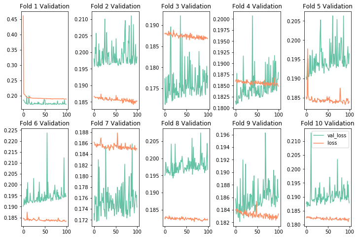
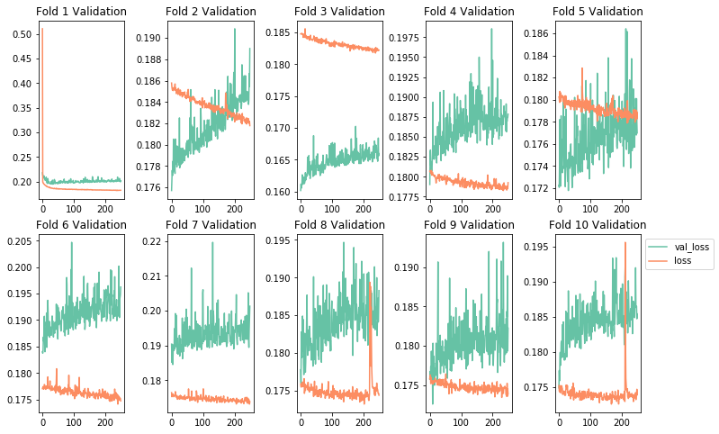
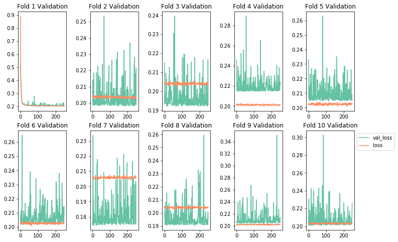
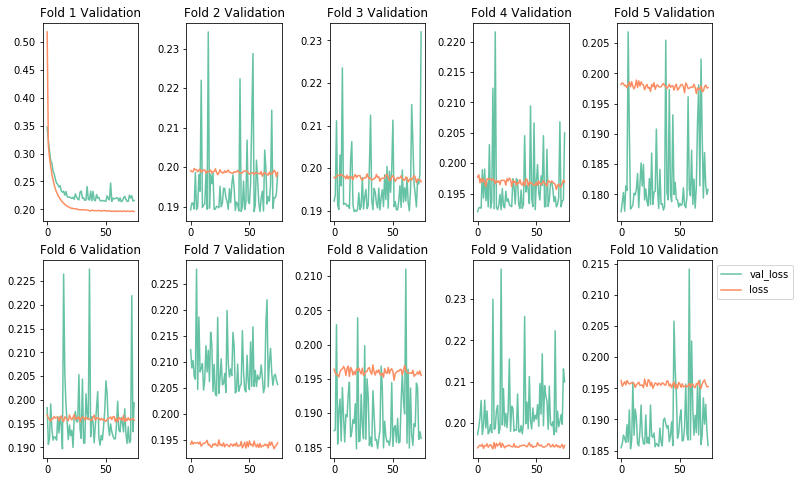
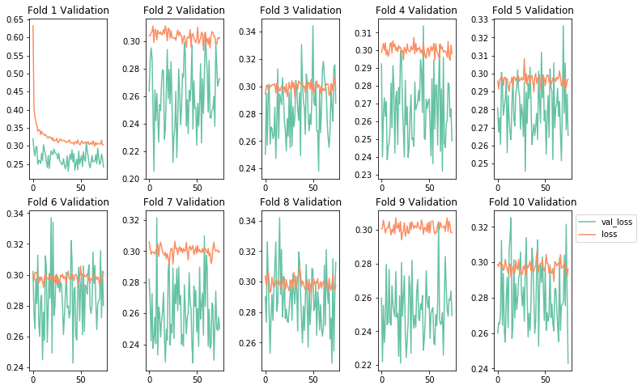
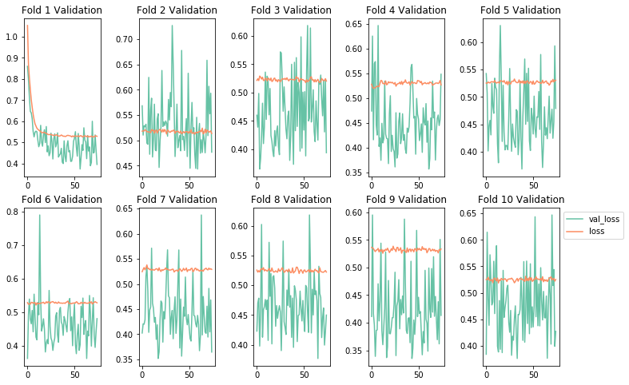

# Tuning and Optimizing Neural Networks - Lab

## Introduction

Now that we've discussed some regularization, initialization and optimization techniques, its time to synthesize those concepts into a cohesive modelling pipeline.  

With this pipeline, yoiu will not only fit an initial model but will also attempt to set various hyperparameters for regularization techniques. Your final model selection will pertain to the test metrics across these models. This will more naturally simulate a problem you might be faced with in practice, and the various modelling decisions you are apt to encounter along the way.  

Recall that our end objective is to achieve a balance between overfitting and underfitting. We've discussed the bias variance tradeoff, and the role of regularization in order to reduce overfitting on training data and improving generalization to new cases. Common frameworks for such a procedure include train/validate/test methodology when data is plentiful, and K-folds cross-validation for smaller, more limited datasets. In this lab, you'll perform the latter, as the dataset in question is fairly limited. 

## Objectives

You will be able to:

* Implement a K-folds cross validation modelling pipeline
* Apply normalization as a preprocessing technique
* Apply regularization techniques to improve your model's generalization
* Choose an appropriate optimization strategy 

## Loading the Data


```python
#Your code here; load and preview the dataset
import pandas as pd

data = pd.read_csv("loan_final.csv", header=0)
data = data.dropna()

print(data.shape)

data.head()

import time
import datetime

start = datetime.datetime.now()
```

    (41394, 16)


```python
data.info()
```

    <class 'pandas.core.frame.DataFrame'>
    Int64Index: 41394 entries, 0 to 42516
    Data columns (total 16 columns):
    loan_amnt              41394 non-null float64
    funded_amnt_inv        41394 non-null float64
    term                   41394 non-null object
    int_rate               41394 non-null object
    installment            41394 non-null float64
    grade                  41394 non-null object
    emp_length             41394 non-null object
    home_ownership         41394 non-null object
    annual_inc             41394 non-null float64
    verification_status    41394 non-null object
    loan_status            41394 non-null object
    purpose                41394 non-null object
    addr_state             41394 non-null object
    total_acc              41394 non-null float64
    total_pymnt            41394 non-null float64
    application_type       41394 non-null object
    dtypes: float64(6), object(10)
    memory usage: 5.4+ MB


## Defining the Problem

Set up the problem by defining X and y. 

For this problem use the following variablea for X:
* loan_amnt
* home_ownership
* funded_amnt_inv
* verification_status
* emp_length
* installment
* annual_inc

Be sure to use dummy variables for categorical variables and to normalize numerical quanitities. Be sure to also remove any rows with null data.


```python
# Your code here; appropriately define X and Y using dummy variables and normalization for preprocessing.
import numpy as np

X0 = data["loan_amnt"]
X1 = data["funded_amnt_inv"]
X2 = data["installment"]
X3 = data["annual_inc"]

# standardized inputs
X0= (X0-np.mean(X0))/(np.std(X0))
X1= (X1-np.mean(X1))/(np.std(X1))
X2= (X2-np.mean(X2))/(np.std(X2))
X3= (X3-np.mean(X3))/(np.std(X3))

#SAME RESULT

#from sklearn.preprocessing import StandardScaler
#sc = StandardScaler()
#X0 = sc.fit_transform(X0)

dummy_ver = pd.get_dummies(data['verification_status'])
dummy_home = pd.get_dummies(data['home_ownership'])
dummy_emp = pd.get_dummies(data['emp_length'])

X = pd.concat([X0, X1, X2, X3, dummy_ver, dummy_home, dummy_emp], axis=1)
X = X.dropna()
y = data["total_pymnt"]
y = (y-np.mean(y))/np.std(y)

print(np.shape(X))
```

    (41394, 23)


## Generating a Hold Out Test Set

While we will be using K-fold cross validation to select an optimal model, we still want a final hold out test set that is completely independent of any modelling decisions. As such, pull out a sample of 10% of the total available data. For consistency of results, use random seed 123. 


```python
# Your code here; generate a hold out test set for final model evaluation. Use random seed 123.
from sklearn.model_selection import train_test_split

X_train, X_test, y_train, y_test = train_test_split(X, y, test_size=0.1, random_state=123)  

# X_train = X_train.reset_index(drop=True)
# y_train = y_train.reset_index(drop=True)  


print(X_train.shape, X_test.shape, y_train.shape, y_test.shape)
X_train.head()
```

    (37254, 23) (4140, 23) (37254,) (4140,)


<div>
<style scoped>
    .dataframe tbody tr th:only-of-type {
        vertical-align: middle;
    }

    .dataframe tbody tr th {
        vertical-align: top;
    }

    .dataframe thead th {
        text-align: right;
    }
</style>
<table border="1" class="dataframe">
  <thead>
    <tr style="text-align: right;">
      <th></th>
      <th>loan_amnt</th>
      <th>funded_amnt_inv</th>
      <th>installment</th>
      <th>annual_inc</th>
      <th>Not Verified</th>
      <th>Source Verified</th>
      <th>Verified</th>
      <th>MORTGAGE</th>
      <th>NONE</th>
      <th>OTHER</th>
      <th>...</th>
      <th>10+ years</th>
      <th>2 years</th>
      <th>3 years</th>
      <th>4 years</th>
      <th>5 years</th>
      <th>6 years</th>
      <th>7 years</th>
      <th>8 years</th>
      <th>9 years</th>
      <th>&lt; 1 year</th>
    </tr>
  </thead>
  <tbody>
    <tr>
      <th>24882</th>
      <td>0.112849</td>
      <td>0.021326</td>
      <td>-0.286460</td>
      <td>0.189661</td>
      <td>0</td>
      <td>1</td>
      <td>0</td>
      <td>1</td>
      <td>0</td>
      <td>0</td>
      <td>...</td>
      <td>1</td>
      <td>0</td>
      <td>0</td>
      <td>0</td>
      <td>0</td>
      <td>0</td>
      <td>0</td>
      <td>0</td>
      <td>0</td>
      <td>0</td>
    </tr>
    <tr>
      <th>5723</th>
      <td>-0.669251</td>
      <td>-0.559691</td>
      <td>-0.587677</td>
      <td>-0.151157</td>
      <td>1</td>
      <td>0</td>
      <td>0</td>
      <td>0</td>
      <td>0</td>
      <td>0</td>
      <td>...</td>
      <td>0</td>
      <td>0</td>
      <td>0</td>
      <td>0</td>
      <td>0</td>
      <td>0</td>
      <td>0</td>
      <td>0</td>
      <td>0</td>
      <td>0</td>
    </tr>
    <tr>
      <th>32465</th>
      <td>0.841010</td>
      <td>1.008356</td>
      <td>1.374322</td>
      <td>0.468512</td>
      <td>1</td>
      <td>0</td>
      <td>0</td>
      <td>1</td>
      <td>0</td>
      <td>0</td>
      <td>...</td>
      <td>0</td>
      <td>0</td>
      <td>0</td>
      <td>0</td>
      <td>0</td>
      <td>0</td>
      <td>0</td>
      <td>1</td>
      <td>0</td>
      <td>0</td>
    </tr>
    <tr>
      <th>34510</th>
      <td>-0.831064</td>
      <td>-0.727696</td>
      <td>-0.806909</td>
      <td>-0.306075</td>
      <td>1</td>
      <td>0</td>
      <td>0</td>
      <td>1</td>
      <td>0</td>
      <td>0</td>
      <td>...</td>
      <td>0</td>
      <td>0</td>
      <td>1</td>
      <td>0</td>
      <td>0</td>
      <td>0</td>
      <td>0</td>
      <td>0</td>
      <td>0</td>
      <td>0</td>
    </tr>
    <tr>
      <th>9396</th>
      <td>0.921917</td>
      <td>1.092359</td>
      <td>1.162835</td>
      <td>0.158677</td>
      <td>0</td>
      <td>1</td>
      <td>0</td>
      <td>0</td>
      <td>0</td>
      <td>0</td>
      <td>...</td>
      <td>0</td>
      <td>0</td>
      <td>0</td>
      <td>0</td>
      <td>1</td>
      <td>0</td>
      <td>0</td>
      <td>0</td>
      <td>0</td>
      <td>0</td>
    </tr>
  </tbody>
</table>
<p>5 rows × 23 columns</p>
</div>


## Defining a K-fold Cross Validation Methodology

Now that your have a complete holdout test set, write a function that takes in the remaining data and performs k-folds cross validation given a model object. 


```python
#Your code here; define a function to evaluate a model object using K folds cross validation.
from sklearn.model_selection import KFold
import seaborn as sns
import matplotlib.pyplot as plt
%matplotlib inline

def k_folds(features_train, labels_train, model_obj, k=10, n_epochs=100):
    colors = sns.color_palette("Set2")

    validation_scores = [] 
    
    kf = KFold(n_splits=10, shuffle=True)
    
    fig, axes = plt.subplots(2, 5, figsize=(12,8))
    for i, (train_index, test_index) in enumerate(kf.split(features_train)):
        "Currently graph imaging assumes 10 folds and is hardcoded to 5x2 layout."
        row = i//5
        col = i%5
        X_train, X_val = features_train.iloc[train_index], features_train.iloc[test_index]
        y_train, y_val = labels_train.iloc[train_index], labels_train.iloc[test_index]
        
        model = model_obj
        hist = model.fit(X_train, y_train, batch_size=32,
                         epochs=n_epochs, verbose=0, validation_data = (X_val, y_val))
        #Note: verboxe=0 turns off printouts regarding training for each epoch.
        #Potential simpler methodology
        validation_score = model.evaluate(X_val, y_val)
        validation_scores.append(validation_score)
        ax = axes[row, col]
        k = 'val_loss'
        d = hist.history[k]
        ax.plot(d, label=k, color=colors[0])

        k = 'loss'
        d = hist.history[k]
        ax.plot(d, label=k, color=colors[1])
        ax.set_title('Fold {} Validation'.format(i+1))
    #Final Graph Formatting
    plt.subplots_adjust(left=None, bottom=None, right=None, top=None, wspace=0.5, hspace=None)
    plt.legend(bbox_to_anchor=(1,1))
    
    #General Overview
    validation_score = np.average(validation_scores)
    print('Mean Validation Score:', validation_score)
    print('Standard Deviation of Validation Scores:', np.std(validation_scores))
    return validation_score
```

## Building a Baseline Model

Here, it is also important to define your evaluation metric that you will look to optimize while tuning the model. Additionally, model training to optimize this metric may consist of using a validation and test set if data is plentiful, or k-folds cross-validation if data is limited. Since this dataset is not overly large, it will be most appropriate to set up a k-folds cross-validation  


```python
from keras.models import Sequential
from keras.layers import Dense


np.random.seed(123)
model = Sequential()
model.add(Dense(7, input_dim=23, kernel_initializer='normal', activation='relu'))
model.add(Dense(10, activation='relu'))
model.add(Dense(1, kernel_initializer='normal', activation = 'linear'))
model.compile(optimizer="sgd" ,loss='mse',metrics=['mse'])
```

    /Users/matthew.mitchell/anaconda3/lib/python3.6/site-packages/h5py/__init__.py:36: FutureWarning: Conversion of the second argument of issubdtype from `float` to `np.floating` is deprecated. In future, it will be treated as `np.float64 == np.dtype(float).type`.
      from ._conv import register_converters as _register_converters
    Using TensorFlow backend.


## Evaluating the Baseline Model with K-Folds Cross Validation

Use your k-folds function to evaluate the baseline model.  

Note: This code block is likely to take 10-20 minutes to run depending on the specs on your computer.
Because of time dependencies, it can be interesting to begin timing these operations for future reference.

Here's a simple little recipe to achieve this:
```
import time
import datetime

now = datetime.datetime.now()
later = datetime.datetime.now()
elapsed = later - now
print('Time Elapsed:', elapsed)
```


```python
#Your code here; use your k-folds function to evaluate the baseline model.
import time
import datetime

now = datetime.datetime.now()

k_folds(X_train, y_train, model)

later = datetime.datetime.now()
elapsed = later - now
print('Time Elapsed:', elapsed)
```

    3726/3726 [==============================] - 0s 8us/step
    3726/3726 [==============================] - 0s 8us/step
    3726/3726 [==============================] - 0s 8us/step
    3726/3726 [==============================] - 0s 8us/step
    3725/3725 [==============================] - 0s 9us/step
    3725/3725 [==============================] - 0s 8us/step
    3725/3725 [==============================] - 0s 8us/step
    3725/3725 [==============================] - 0s 8us/step
    3725/3725 [==============================] - 0s 8us/step
    3725/3725 [==============================] - 0s 9us/step
    Mean Validation Score: 0.1867430368626911
    Standard Deviation of Validation Scores: 0.012845184798611412
    Time Elapsed: 0:10:14.208064


## Intentionally Overfitting a Model

Now that you've developed a baseline model, its time to intentionally overfit a model. To overfit a model, you can:
* Add layers
* Make the layers bigger
* Increase the number of training epochs

Again, be careful here. Think about the limitations of your resources, both in terms of your computers specs and how much time and patience you have to let the process run. Also keep in mind that you will then be regularizing these overfit models, meaning another round of experiments and more time and resources.


```python
#Your code here
#Timing Notes: On a top of the line mac-book pro, using our 10 fold cross validation methodology,
#a 5-layer neural network with 10 units per hidden layer and 100 epochs took ~15 minutes to train and validate

now = datetime.datetime.now()

#Model Mod 1: Adding More Layers
model = Sequential()
model.add(Dense(7, input_dim=23, kernel_initializer='normal', activation='relu'))
model.add(Dense(10, activation='relu'))
model.add(Dense(10, activation='relu'))
model.add(Dense(10, activation='relu'))
model.add(Dense(1, kernel_initializer='normal', activation = 'linear'))
model.compile(optimizer="sgd" ,loss='mse',metrics=['mse'])

k_folds(X_train, y_train, model)    

later = datetime.datetime.now()
elapsed = later - now
print('Time Elapsed:', elapsed)
```

    3726/3726 [==============================] - 0s 9us/step
    3726/3726 [==============================] - 0s 9us/step
    3726/3726 [==============================] - 0s 10us/step
    3726/3726 [==============================] - 0s 9us/step
    3725/3725 [==============================] - 0s 9us/step
    3725/3725 [==============================] - 0s 9us/step
    3725/3725 [==============================] - 0s 9us/step
    3725/3725 [==============================] - 0s 9us/step
    3725/3725 [==============================] - 0s 9us/step
    3725/3725 [==============================] - 0s 9us/step
    Mean Validation Score: 0.18724432223595264
    Standard Deviation of Validation Scores: 0.009272120103293187
    Time Elapsed: 0:12:21.555153





```python
#Model Mod 2: More Layers and Bigger Layers
#Your code here
#Timing Notes: On a top of the line mac-book pro, using our 10 fold cross validation methodology,
#a 5-layer neural network with 25 units per hidden layer and 100 epochs took ~25 minutes to train and validate

now = datetime.datetime.now()

model = Sequential()
model.add(Dense(7, input_dim=23, kernel_initializer='normal', activation='relu'))
model.add(Dense(25, activation='relu'))
model.add(Dense(25, activation='relu'))
model.add(Dense(25, activation='relu'))
model.add(Dense(1, kernel_initializer='normal', activation = 'linear'))
model.compile(optimizer="sgd" ,loss='mse',metrics=['mse'])

k_folds(X_train, y_train, model)    

later = datetime.datetime.now()
elapsed = later - now
print('Time Elapsed:', elapsed)
```

    3726/3726 [==============================] - 0s 10us/step
    3726/3726 [==============================] - 0s 9us/step
    3726/3726 [==============================] - 0s 11us/step
    3726/3726 [==============================] - 0s 11us/step
    3725/3725 [==============================] - 0s 11us/step
    3725/3725 [==============================] - 0s 10us/step
    3725/3725 [==============================] - 0s 11us/step
    3725/3725 [==============================] - 0s 11us/step
    3725/3725 [==============================] - 0s 9us/step
    3725/3725 [==============================] - 0s 10us/step
    Mean Validation Score: 0.18516579863678612
    Standard Deviation of Validation Scores: 0.015559724349954715
    Time Elapsed: 0:12:32.375603


```python
#Model Mod 3: More Layers, More Epochs 
#Timing Notes: On a top of the line mac-book pro, using our 10 fold cross validation methodology,
#a 5-layer neural network with 10 units per hidden layer and 250 epochs took ~45 minutes to train and validate

now = datetime.datetime.now()

model = Sequential()
model.add(Dense(7, input_dim=23, kernel_initializer='normal', activation='relu'))
model.add(Dense(10, activation='relu'))
model.add(Dense(10, activation='relu'))
model.add(Dense(10, activation='relu'))
model.add(Dense(1, kernel_initializer='normal', activation = 'linear'))
model.compile(optimizer="sgd" ,loss='mse',metrics=['mse'])

k_folds(X_train, y_train, model, n_epochs=250)

later = datetime.datetime.now()
elapsed = later - now
print('Time Elapsed:', elapsed)
```

    3726/3726 [==============================] - 0s 12us/step
    3726/3726 [==============================] - 0s 10us/step
    3726/3726 [==============================] - 0s 10us/step
    3726/3726 [==============================] - 0s 9us/step
    3725/3725 [==============================] - 0s 9us/step
    3725/3725 [==============================] - 0s 11us/step
    3725/3725 [==============================] - 0s 11us/step
    3725/3725 [==============================] - 0s 11us/step
    3725/3725 [==============================] - 0s 10us/step
    3725/3725 [==============================] - 0s 11us/step
    Mean Validation Score: 0.1875320880760647
    Standard Deviation of Validation Scores: 0.010433302386320883
    Time Elapsed: 0:31:30.552238





## Regularizing the Model to Achieve Balance  

Now that you have a powerful model (albeit an overfit one), we can now increase the generalization of the model by using some of the regularization techniques we discussed. Some options you have to try include:  
* Adding dropout
* Adding L1/L2 regularization
* Altering the layer architecture (add or remove layers similar to above)  

This process will be constrained by time and resources. Be sure to test at least 2 different methodologies, such as dropout and L2 regularization. If you have the time, feel free to continue experimenting.

Notes: 


```python
#L1 Regularization
from keras import regularizers

#kernel_regularizer=regularizers.l1(0.005)
#kernel_regularizer=regularizers.l2(0.005)
#model.add(layers.Dropout(0.3))

now = datetime.datetime.now()


model = Sequential()
model.add(Dense(7, input_dim=23, kernel_initializer='normal', activation='relu'))
model.add(Dense(10, kernel_regularizer=regularizers.l1(0.005), activation='relu'))
model.add(Dense(10, kernel_regularizer=regularizers.l1(0.005), activation='relu'))
model.add(Dense(10, kernel_regularizer=regularizers.l1(0.005), activation='relu'))
model.add(Dense(1, kernel_initializer='normal', activation = 'linear'))
model.compile(optimizer="sgd" ,loss='mse',metrics=['mse'])

k_folds(X_train, y_train, model, n_epochs=250) 

later = datetime.datetime.now()
elapsed = later - now
print('Time Elapsed:', elapsed)
```

    3726/3726 [==============================] - 0s 11us/step
    3726/3726 [==============================] - 0s 11us/step
    3726/3726 [==============================] - 0s 10us/step
    3726/3726 [==============================] - 0s 11us/step
    3725/3725 [==============================] - 0s 10us/step
    3725/3725 [==============================] - 0s 11us/step
    3725/3725 [==============================] - 0s 11us/step
    3725/3725 [==============================] - 0s 10us/step
    3725/3725 [==============================] - 0s 10us/step
    3725/3725 [==============================] - 0s 10us/step
    Mean Validation Score: 0.1996706217834216
    Standard Deviation of Validation Scores: 0.014530697314462332
    Time Elapsed: 0:34:52.511440





```python
#L2 Regularization and Early Stopping
now = datetime.datetime.now()


model = Sequential()
model.add(Dense(7, input_dim=23, kernel_initializer='normal', activation='relu'))
model.add(Dense(10, kernel_regularizer=regularizers.l2(0.005), activation='relu'))
model.add(Dense(10, kernel_regularizer=regularizers.l2(0.005), activation='relu'))
model.add(Dense(10, kernel_regularizer=regularizers.l2(0.005), activation='relu'))
model.add(Dense(1, kernel_initializer='normal', activation = 'linear'))
model.compile(optimizer="sgd" ,loss='mse',metrics=['mse'])

k_folds(X_train, y_train, model, n_epochs=75) 

later = datetime.datetime.now()
elapsed = later - now
print('Time Elapsed:', elapsed)
```

    3726/3726 [==============================] - 0s 11us/step
    3726/3726 [==============================] - 0s 11us/step
    3726/3726 [==============================] - 0s 11us/step
    3726/3726 [==============================] - 0s 11us/step
    3725/3725 [==============================] - 0s 11us/step
    3725/3725 [==============================] - 0s 11us/step
    3725/3725 [==============================] - 0s 11us/step
    3725/3725 [==============================] - 0s 11us/step
    3725/3725 [==============================] - 0s 11us/step
    3725/3725 [==============================] - 0s 11us/step
    Mean Validation Score: 0.19622942410630326
    Standard Deviation of Validation Scores: 0.009876928439544776
    Time Elapsed: 0:10:31.340739





```python
#Dropout and Early Stopping
from keras import layers

now = datetime.datetime.now()


model = Sequential()
model.add(Dense(7, input_dim=23, kernel_initializer='normal', activation='relu'))
model.add(Dense(10, activation='relu'))
model.add(layers.Dropout(0.3))
model.add(Dense(10, activation='relu'))
model.add(layers.Dropout(0.3))
model.add(Dense(10, activation='relu'))
model.add(layers.Dropout(0.3))
model.add(Dense(1, kernel_initializer='normal', activation = 'linear'))
model.compile(optimizer="sgd" ,loss='mse',metrics=['mse'])

k_folds(X_train, y_train, model, n_epochs=75) 

later = datetime.datetime.now()
elapsed = later - now
print('Time Elapsed:', elapsed)
```

    3726/3726 [==============================] - 0s 12us/step
    3726/3726 [==============================] - 0s 11us/step
    3726/3726 [==============================] - 0s 12us/step
    3726/3726 [==============================] - 0s 12us/step
    3725/3725 [==============================] - 0s 12us/step
    3725/3725 [==============================] - 0s 11us/step
    3725/3725 [==============================] - 0s 11us/step
    3725/3725 [==============================] - 0s 12us/step
    3725/3725 [==============================] - 0s 12us/step
    3725/3725 [==============================] - 0s 11us/step
    Mean Validation Score: 0.2651127921690995
    Standard Deviation of Validation Scores: 0.021989097678187602
    Time Elapsed: 0:12:14.699325





```python
#L1, Dropout and Early Stopping

now = datetime.datetime.now()


model = Sequential()
model.add(Dense(7, input_dim=23, kernel_initializer='normal', activation='relu'))
model.add(Dense(10, kernel_regularizer=regularizers.l1(0.005), activation='relu'))
model.add(layers.Dropout(0.3))
model.add(Dense(10, kernel_regularizer=regularizers.l1(0.005), activation='relu'))
model.add(layers.Dropout(0.3))
model.add(Dense(10, kernel_regularizer=regularizers.l1(0.005), activation='relu'))
model.add(layers.Dropout(0.3))
model.add(Dense(1, kernel_initializer='normal', activation = 'linear'))
model.compile(optimizer="sgd" ,loss='mse',metrics=['mse'])

k_folds(X_train, y_train, model, n_epochs=75) 

later = datetime.datetime.now()
elapsed = later - now
print('Time Elapsed:', elapsed)
```

    3726/3726 [==============================] - 0s 13us/step
    3726/3726 [==============================] - 0s 13us/step
    3726/3726 [==============================] - 0s 13us/step
    3726/3726 [==============================] - 0s 13us/step
    3725/3725 [==============================] - 0s 13us/step
    3725/3725 [==============================] - 0s 13us/step
    3725/3725 [==============================] - 0s 13us/step
    3725/3725 [==============================] - 0s 13us/step
    3725/3725 [==============================] - 0s 12us/step
    3725/3725 [==============================] - 0s 12us/step
    Mean Validation Score: 0.269690352930027
    Standard Deviation of Validation Scores: 0.029000241686130166
    Time Elapsed: 0:13:03.824693





```python
end = datetime.datetime.now()
elapsed = end - start
print('Total Time Elapsed:', elapsed)
```

    Total Time Elapsed: 2:17:27.917136


## Final Evaluation

Now that you have selected a network architecture, tested various regularization procedures and tuned hyperparameters via a validation methodology, it is time to evaluate your finalized model once and for all. Fit the model using all of the training and validation data using the architecture and hyperparameters that were most effective in your expirements above. Afterwards, measure the overall performance on the hold-out test data which has been left untouched (and hasn't leaked any data into the modelling process)!


```python
#Your code here; final model training on entire training set followed by evaluation on hold-out data

#Based on our model runs above, it appears that using  L2 Regularization and Early Stopping
#improves our variance 10 fold in exchange for a slight increase in MSE
#As such, we will choose this as our final model in hopes that the model will have improved generalization
now = datetime.datetime.now()


model = Sequential()
model.add(Dense(7, input_dim=23, kernel_initializer='normal', activation='relu'))
model.add(Dense(10, kernel_regularizer=regularizers.l2(0.005), activation='relu'))
model.add(Dense(10, kernel_regularizer=regularizers.l2(0.005), activation='relu'))
model.add(Dense(10, kernel_regularizer=regularizers.l2(0.005), activation='relu'))
model.add(Dense(1, kernel_initializer='normal', activation = 'linear'))
model.compile(optimizer="sgd" ,loss='mse',metrics=['mse'])

hist =  hist = model.fit(X_train, y_train, batch_size=32, epochs=75)

later = datetime.datetime.now()
elapsed = later - now
print('Time Elapsed:', elapsed)
```

    Epoch 1/75
    37254/37254 [==============================] - 2s 41us/step - loss: 0.4778 - mean_squared_error: 0.3521
    Epoch 2/75
    37254/37254 [==============================] - 1s 28us/step - loss: 0.3061 - mean_squared_error: 0.2035
    Epoch 3/75
    37254/37254 [==============================] - 1s 28us/step - loss: 0.2846 - mean_squared_error: 0.2015 0s - loss: 0
    Epoch 4/75
    37254/37254 [==============================] - 1s 28us/step - loss: 0.2688 - mean_squared_error: 0.2011
    Epoch 5/75
    37254/37254 [==============================] - 1s 28us/step - loss: 0.2556 - mean_squared_error: 0.2000
    Epoch 6/75
    37254/37254 [==============================] - 1s 28us/step - loss: 0.2461 - mean_squared_error: 0.2000
    Epoch 7/75
    37254/37254 [==============================] - 1s 28us/step - loss: 0.2374 - mean_squared_error: 0.1989 0s - loss: 0.2379 - mean_squared_error: 
    Epoch 8/75
    37254/37254 [==============================] - 1s 28us/step - loss: 0.2315 - mean_squared_error: 0.1989
    Epoch 9/75
    37254/37254 [==============================] - 1s 28us/step - loss: 0.2260 - mean_squared_error: 0.1982
    Epoch 10/75
    37254/37254 [==============================] - 1s 29us/step - loss: 0.2224 - mean_squared_error: 0.1983
    Epoch 11/75
    37254/37254 [==============================] - 1s 28us/step - loss: 0.2185 - mean_squared_error: 0.1973
    Epoch 12/75
    37254/37254 [==============================] - 1s 28us/step - loss: 0.2157 - mean_squared_error: 0.1969
    Epoch 13/75
    37254/37254 [==============================] - 1s 29us/step - loss: 0.2134 - mean_squared_error: 0.1965
    Epoch 14/75
    37254/37254 [==============================] - 1s 28us/step - loss: 0.2116 - mean_squared_error: 0.1962
    Epoch 15/75
    37254/37254 [==============================] - 1s 29us/step - loss: 0.2101 - mean_squared_error: 0.1959 0s - loss: 0.2127 - mean_squared_error: 
    Epoch 16/75
    37254/37254 [==============================] - 1s 28us/step - loss: 0.2089 - mean_squared_error: 0.1956
    Epoch 17/75
    37254/37254 [==============================] - 1s 28us/step - loss: 0.2074 - mean_squared_error: 0.1949
    Epoch 18/75
    37254/37254 [==============================] - 1s 28us/step - loss: 0.2065 - mean_squared_error: 0.1946
    Epoch 19/75
    37254/37254 [==============================] - 1s 28us/step - loss: 0.2057 - mean_squared_error: 0.1944
    Epoch 20/75
    37254/37254 [==============================] - 1s 29us/step - loss: 0.2046 - mean_squared_error: 0.1938
    Epoch 21/75
    37254/37254 [==============================] - 1s 28us/step - loss: 0.2041 - mean_squared_error: 0.1936
    Epoch 22/75
    37254/37254 [==============================] - 1s 29us/step - loss: 0.2039 - mean_squared_error: 0.1938
    Epoch 23/75
    37254/37254 [==============================] - 1s 29us/step - loss: 0.2033 - mean_squared_error: 0.1935
    Epoch 24/75
    37254/37254 [==============================] - 1s 28us/step - loss: 0.2032 - mean_squared_error: 0.1936 0s - loss: 0.2039 - mean_squared_error: 0.
    Epoch 25/75
    37254/37254 [==============================] - 1s 29us/step - loss: 0.2026 - mean_squared_error: 0.1934
    Epoch 26/75
    37254/37254 [==============================] - 1s 28us/step - loss: 0.2025 - mean_squared_error: 0.1934
    Epoch 27/75
    37254/37254 [==============================] - 1s 28us/step - loss: 0.2028 - mean_squared_error: 0.1938
    Epoch 28/75
    37254/37254 [==============================] - 1s 29us/step - loss: 0.2025 - mean_squared_error: 0.1937
    Epoch 29/75
    37254/37254 [==============================] - 1s 28us/step - loss: 0.2016 - mean_squared_error: 0.1929
    Epoch 30/75
    37254/37254 [==============================] - 1s 29us/step - loss: 0.2013 - mean_squared_error: 0.1927
    Epoch 31/75
    37254/37254 [==============================] - 1s 28us/step - loss: 0.2013 - mean_squared_error: 0.1929
    Epoch 32/75
    37254/37254 [==============================] - 1s 29us/step - loss: 0.2007 - mean_squared_error: 0.1924
    Epoch 33/75
    37254/37254 [==============================] - 2s 41us/step - loss: 0.2017 - mean_squared_error: 0.1935 0s - loss: 0.2011 - mean_squared_err
    Epoch 34/75
    37254/37254 [==============================] - 1s 28us/step - loss: 0.2008 - mean_squared_error: 0.1927
    Epoch 35/75
    37254/37254 [==============================] - 1s 28us/step - loss: 0.2013 - mean_squared_error: 0.1932
    Epoch 36/75
    37254/37254 [==============================] - 1s 28us/step - loss: 0.2014 - mean_squared_error: 0.1934 0s - loss: 0.2018 - 
    Epoch 37/75
    37254/37254 [==============================] - 1s 29us/step - loss: 0.2005 - mean_squared_error: 0.1926
    Epoch 38/75
    37254/37254 [==============================] - 1s 28us/step - loss: 0.2005 - mean_squared_error: 0.1927
    Epoch 39/75
    37254/37254 [==============================] - 1s 28us/step - loss: 0.2001 - mean_squared_error: 0.1923
    Epoch 40/75
    37254/37254 [==============================] - 1s 29us/step - loss: 0.2005 - mean_squared_error: 0.1928
    Epoch 41/75
    37254/37254 [==============================] - 1s 29us/step - loss: 0.2006 - mean_squared_error: 0.1930
    Epoch 42/75
    37254/37254 [==============================] - 1s 29us/step - loss: 0.2004 - mean_squared_error: 0.1928
    Epoch 43/75
    37254/37254 [==============================] - 1s 28us/step - loss: 0.2007 - mean_squared_error: 0.1932
    Epoch 44/75
    37254/37254 [==============================] - 1s 29us/step - loss: 0.2001 - mean_squared_error: 0.1927
    Epoch 45/75
    37254/37254 [==============================] - 1s 28us/step - loss: 0.2001 - mean_squared_error: 0.1927
    Epoch 46/75
    37254/37254 [==============================] - 1s 28us/step - loss: 0.2005 - mean_squared_error: 0.1931
    Epoch 47/75
    37254/37254 [==============================] - 1s 28us/step - loss: 0.2008 - mean_squared_error: 0.1935
    Epoch 48/75
    37254/37254 [==============================] - 1s 29us/step - loss: 0.2003 - mean_squared_error: 0.1930
    Epoch 49/75
    37254/37254 [==============================] - 1s 29us/step - loss: 0.2000 - mean_squared_error: 0.1928
    Epoch 50/75
    37254/37254 [==============================] - 1s 29us/step - loss: 0.2003 - mean_squared_error: 0.1931
    Epoch 51/75
    37254/37254 [==============================] - 1s 28us/step - loss: 0.1995 - mean_squared_error: 0.1923
    Epoch 52/75
    37254/37254 [==============================] - 1s 28us/step - loss: 0.1998 - mean_squared_error: 0.1926
    Epoch 53/75
    37254/37254 [==============================] - 1s 28us/step - loss: 0.2001 - mean_squared_error: 0.1930
    Epoch 54/75
    37254/37254 [==============================] - 1s 28us/step - loss: 0.2001 - mean_squared_error: 0.1930
    Epoch 55/75
    37254/37254 [==============================] - 1s 28us/step - loss: 0.1998 - mean_squared_error: 0.1928
    Epoch 56/75
    37254/37254 [==============================] - 1s 28us/step - loss: 0.1992 - mean_squared_error: 0.1922
    Epoch 57/75
    37254/37254 [==============================] - 1s 29us/step - loss: 0.1992 - mean_squared_error: 0.1922
    Epoch 58/75
    37254/37254 [==============================] - 1s 28us/step - loss: 0.1995 - mean_squared_error: 0.1925
    Epoch 59/75
    37254/37254 [==============================] - 1s 29us/step - loss: 0.1990 - mean_squared_error: 0.1921
    Epoch 60/75
    37254/37254 [==============================] - 1s 29us/step - loss: 0.1991 - mean_squared_error: 0.1921
    Epoch 61/75
    37254/37254 [==============================] - 1s 28us/step - loss: 0.1996 - mean_squared_error: 0.1927
    Epoch 62/75
    37254/37254 [==============================] - 1s 29us/step - loss: 0.1994 - mean_squared_error: 0.1925 0s - loss: 0.194
    Epoch 63/75
    37254/37254 [==============================] - 1s 28us/step - loss: 0.1991 - mean_squared_error: 0.1923
    Epoch 64/75
    37254/37254 [==============================] - 1s 29us/step - loss: 0.1988 - mean_squared_error: 0.1920
    Epoch 65/75
    37254/37254 [==============================] - 1s 28us/step - loss: 0.1997 - mean_squared_error: 0.1929
    Epoch 66/75
    37254/37254 [==============================] - 1s 28us/step - loss: 0.1993 - mean_squared_error: 0.1925
    Epoch 67/75
    37254/37254 [==============================] - 1s 28us/step - loss: 0.1992 - mean_squared_error: 0.1924
    Epoch 68/75
    37254/37254 [==============================] - 1s 28us/step - loss: 0.1983 - mean_squared_error: 0.1916
    Epoch 69/75
    37254/37254 [==============================] - 1s 29us/step - loss: 0.1987 - mean_squared_error: 0.1920
    Epoch 70/75
    37254/37254 [==============================] - 1s 28us/step - loss: 0.1990 - mean_squared_error: 0.1924
    Epoch 71/75
    37254/37254 [==============================] - 1s 28us/step - loss: 0.1995 - mean_squared_error: 0.1929
    Epoch 72/75
    37254/37254 [==============================] - 1s 28us/step - loss: 0.1993 - mean_squared_error: 0.1926
    Epoch 73/75
    37254/37254 [==============================] - 1s 28us/step - loss: 0.1993 - mean_squared_error: 0.1927
    Epoch 74/75
    37254/37254 [==============================] - 1s 28us/step - loss: 0.1997 - mean_squared_error: 0.1931
    Epoch 75/75
    37254/37254 [==============================] - 1s 29us/step - loss: 0.1987 - mean_squared_error: 0.1921 0s - loss: 0.1
    Time Elapsed: 0:01:20.638696


```python
model.evaluate(X_test, y_test)

```

    4140/4140 [==============================] - 0s 42us/step


    [0.18712875352101627, 0.1803887076495926]


## Additional Resources

https://machinelearningmastery.com/dropout-regularization-deep-learning-models-keras/

https://machinelearningmastery.com/grid-search-hyperparameters-deep-learning-models-python-keras/

https://machinelearningmastery.com/regression-tutorial-keras-deep-learning-library-python/

https://stackoverflow.com/questions/37232782/nan-loss-when-training-regression-network
https://www.springboard.com/blog/free-public-data-sets-data-science-project/

## Summary

In this lab, we investigated some data from *The Lending Club* in a complete data science pipeline regarding neural networks. We began with reserving a hold-out set for testing which never was touched during the modeling phase. From there, we implemented a k-fold cross validation methodology in order to assess an initial baseline model and various regularization methods. From here, we'll begin to investigate other neural network architectures such as CNNs.
